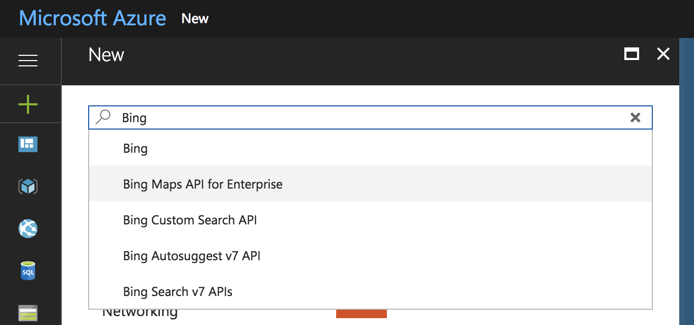
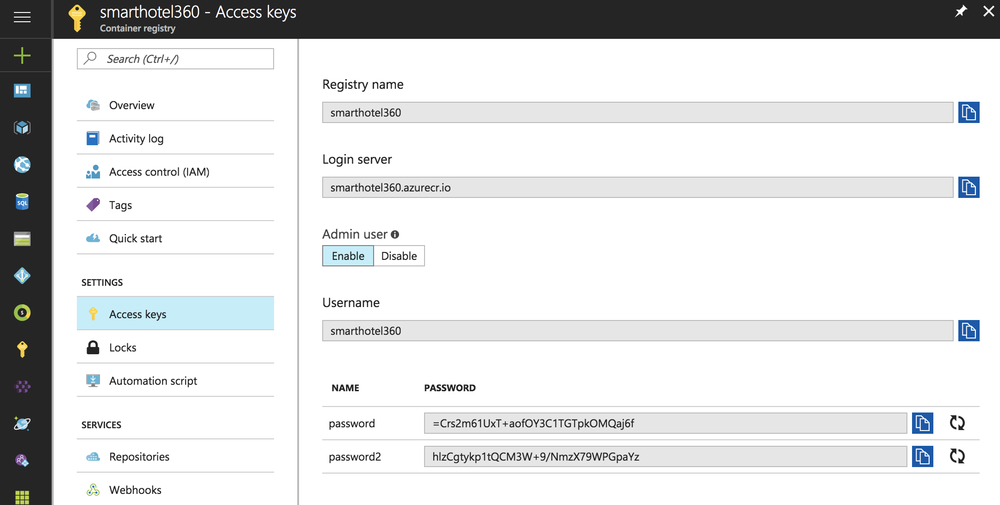
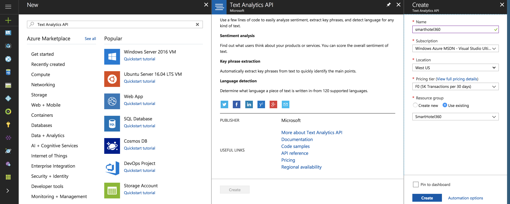
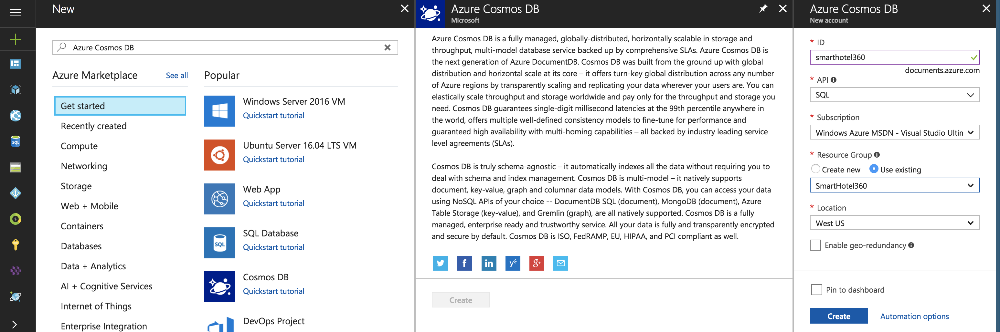
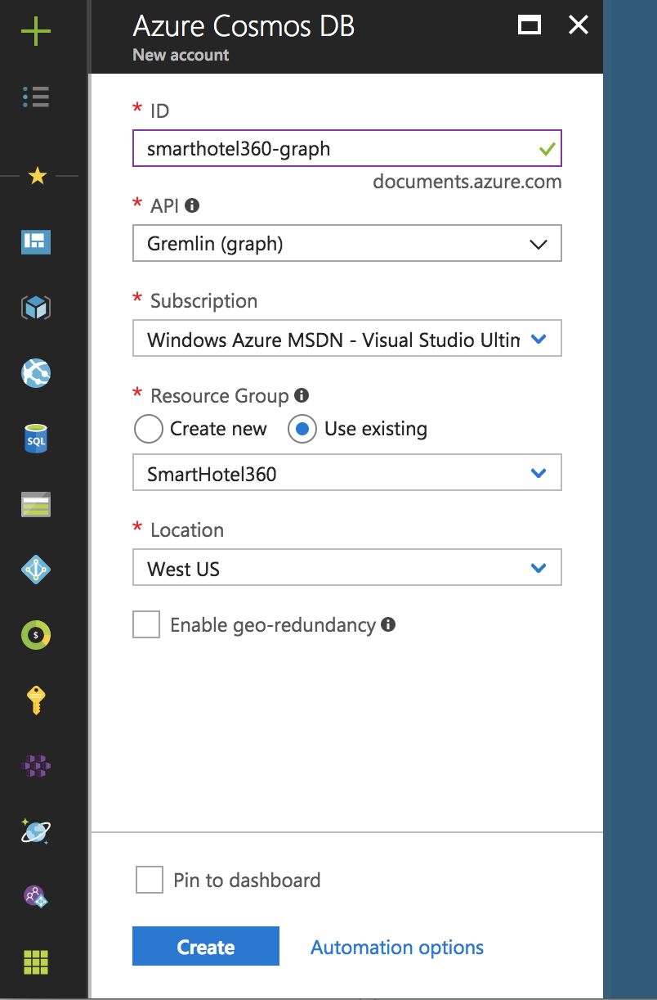

If you prefer to manually create the Azure resources follow this walk though:

1. Create a Bing Maps API for Enterprise resource in the Azure Portal by clicking the **New** button, then searching for `Bing` and selecting the **Bing Maps API for Enterprise** option. 

    

1. The free tier for public web sites should be appropriate for getting started. 

    

1. Create a new Storage Account in the same resource group as the Bing Maps API resource. 

    

1. Create a new Azure Container Registry resource by clicking the **New** button in the Azure Portal, then searching for `Registry.` Any tier of service would be appropriate. Create the resource in the same resource group as the Bing Maps API for Enterprise resource. 

    

1. Once the Azure Container Registry instance has been created, enable the Admin user as shown in the screen shot below. 

    

1. Create a new Basic Linux App Service Plan in the same region and resource group as the Azure Container Registry and Bing Maps API for Enterprise resources. 

    

1. Create a Function App based on JavaScript language, you can select the Linux App Service Plan and the storage that you just created.

    

1. Create a Cognitive Services Text Analytics API resource using the Azure Portal. 

    

1. Create a new Cosmos DB database, and select the SQL API. 

    

1. Create a second Cosmos DB database, and select the Graph (Gremlin) API. 

    

1. Create a new Logic App using the Azure Portal. 

    
