# SmartHotel360

During our **Connect(); 2017** event this year we presented beautiful app demos using Microsoft developer tools and technologies.

We are happy to announce the release of SmartHotel360. This release intends to share a simplified version of SmartHotel360 reference sample apps used at Connect(); 2017 Keynotes. If you missed it, you can watch <a href="https://channel9.msdn.com/Events/Connect/2017/K100">Scott Guthrie’s Keynote: Journey to the Intelligent Cloud</a> on Channel 9.

## Sentiment Analysis App
This repo contains the Node.js Sentiment Analysis App built with Visual Studio Code.

For hotel managers, we built a simple Node.js website to analyze customer sentiment from Twitter by using Text Analysis Cognitive Services APIs. This website was built with Visual Studio Code and we used multiple of our newest extensions for Cosmos DB, App Service, Azure Functions, and Docker for Visual Studio Code and Azure to build this app.

## Other SmartHotel360 Repos
For this reference app scenario, we built several consumer and line-of-business apps and an Azure backend. You can find all SmartHotel360 repos in the following locations:

* [SmartHotel360 ](https://github.com/Microsoft/SmartHotel360)
* [IoT](https://github.com/Microsoft/SmartHotel360-IoT)
* [Backend](https://github.com/Microsoft/SmartHotel360-Backend)
* [Website](https://github.com/Microsoft/SmartHotel360-Website)
* [Mobile](https://github.com/Microsoft/SmartHotel360-Mobile)
* [Sentiment Analysis](https://github.com/Microsoft/SmartHotel360-SentimentAnalysis)
* [Registration](https://github.com/Microsoft/SmartHotel360-Registration)

## Azure Deployment and Setup

This section will walk through using the Azure Portal and Visual Studio Code to create all of the resources you'd need to deploy the demo to Azure. 

We have added an ARM template so you can automate the resources creation, you still need to configure the Cosmos DB and the Logic App.

<a href="https://portal.azure.com/#create/Microsoft.Template/uri/https%3A%2F%2Fraw.githubusercontent.com%2FMicrosoft%2FSmartHotel360-SentimentAnalysis%2Fmaster%2FSource%2FARM%2FSmartHotel360.SentimentAnalysis.Azure.Deploy.json?target=_blank" target='_blank'></a>

 > Note: The deployment of all the resources can take up to 7 minutes. 

Optionally, you can create the Azure resources manually following the [Azure Manual Deployment](Documents/AzureManualDeployment.md) guide. 

1. Create a new collection in the Cosmos DB database using the Azure Portal's Data Explorer. Name the **Database Id** `TweetsDB` and the **Collection Id** `Tweets`. 

    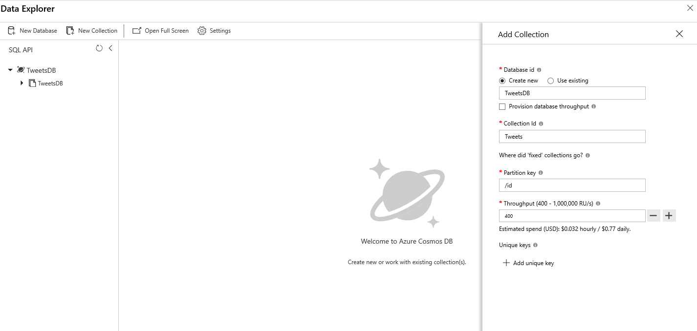
    
> Note: For partition key you can use /id

1. Create a new Graph in the new Cosmos DB database id named `TweetsDB` and a graph id of `Tweets`. 

    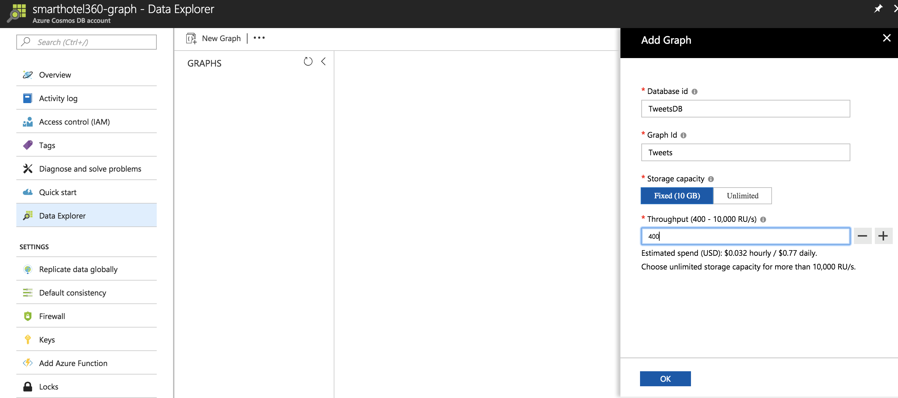


1. Navigate to the Logic App in the Azure Portal, and select the **When a new tweet is posted** trigger. 

    

1. You'll need to log in to your Twitter account and to give it access to the Azure Logic App to login as you. 

    > Note: The Logic App won't post tweets or mine your followers. The reason for logging in with a real Twitter account is to let the Logic App pull Tweets and scan them for keywords and hashtags. 

1. Enter the string `#SmartHotel360` in the **Search text** box. Then, click the **New step** button. Then, click the **Add an action** button.  

    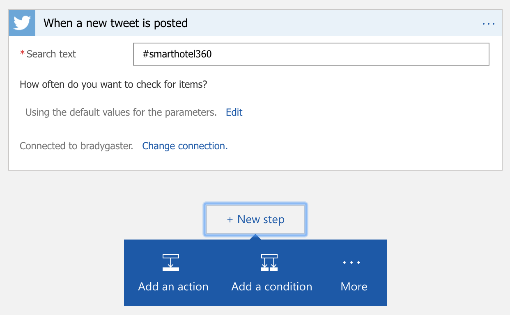

1. Add a new **Azure Cosmos DB - Create or update document** action. 

    

1. Give the connection a name, and select the Cosmos DB resource you created earlier that uses the SQL API. 

    

1. Provide the string `TweetsDB` for the **Database ID** field, `Tweets` for the **Collection ID** field, and then paste in the JSON code below into the **Document** field. 

    ```json
    {
        "created": "@triggerBody()?['CreatedAtIso']",
        "id": "@triggerBody()?['TweetId']",
        "text": "@triggerBody()?['TweetText']",
        "user": "@{triggerBody()?['TweetedBy']}"
    }
    ```
    When you've completed this step the Logic App designer should look like the screen shot below. 

    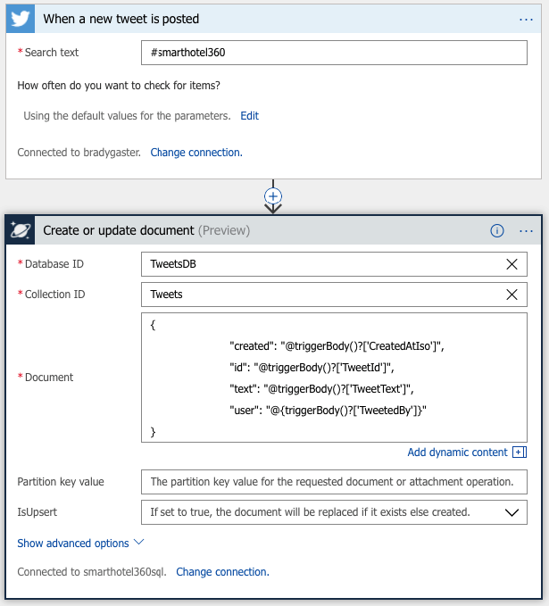

1. Click the **Save** button in the Logic App Designer. Once the Logic App has been saved the view of the *Create or update document* step should change somewhat, demonstrating that the JSON will be constructed using properties from the incoming Tweet. 

    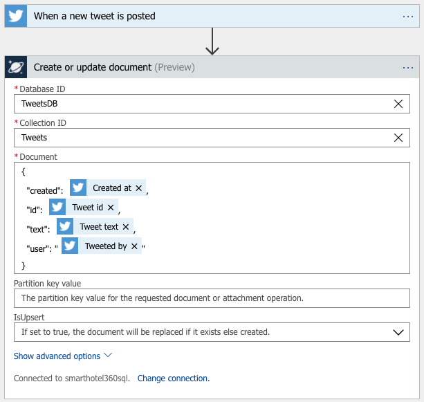

## Run the Logic App

Once the Logic App has been saved, testing it out is as easy as posting a Tweet containing the desired string. The next time the Logic App is triggered, the JSON data captured is visible in the Logic App Designer.


Using the Cosmos DB Data Explorer in the Azure Portal, you can see the JSON document that has been from the Logic App execution. 


## Local Development Setup

The following prerequisites are needed to use the code in this repository: 

1. Git
1. [Docker](https://www.docker.com/get-docker)
1. [Node.js](https://nodejs.org) (Latest LTS)
1. [Visual Studio Code](http://code.visualstudio.com), with the following Azure-related extensions installed:
    1. [Azure App Service](https://marketplace.visualstudio.com/items?itemName=ms-azuretools.vscode-azureappservice)
    1. [Azure Cosmos DB](https://marketplace.visualstudio.com/items?itemName=ms-azuretools.vscode-cosmosdb)
    1. [Azure Functions](https://marketplace.visualstudio.com/items?itemName=ms-azuretools.vscode-azurefunctions)
    1. [Azure Storage](https://marketplace.visualstudio.com/items?itemName=ms-azuretools.vscode-azurestorage)
    1. [Docker](https://marketplace.visualstudio.com/items?itemName=PeterJausovec.vscode-docker)
1. [Azure CLI](https://docs.microsoft.com/en-us/cli/azure/install-azure-cli?view=azure-cli-latest)
1. [.NET Core SDK](https://www.microsoft.com/net/core) (prerequisite to the Azure Functions CLI)
1. [Azure Functions CLI](https://github.com/Azure/azure-functions-cli)

The steps below will enable you to debug the Azure Functions locally and deploy it to Azure App Service once it is ready. You will also package up the web app into a Docker container and publish it to App Service on Containers. 

### Login to Azure within Visual Studio Code

1. Clone this repository, then open the `Source` directory as your workspace in Visual Studio Code.

1. Sign in to your Azure subscription by using `F1` (Windows) or `Cmd-Shift-P` (Mac) to open the Visual Studio Code command palette. Type `Azure` and find the `Azure: Sign In` commannd to sign in to your Azure account. 

    

1. By clicking **Copy and Open**, your browser will open and allow you to paste in the authentication code. Then you can select the Microsoft or organizational account you want to use. 

    

    Once the authentication process completes you'll see the email address you used to sign in down in the bottom-left corner of Visual Studio Code. By clicking your account name you'll be able to select from a drop-down list of your Azure subscriptions. 

1. Now that you're logged into your Azure subscription you will see the resources you created earlier in the various Azure resource explorers in Visual Studio Code. 

     

### Configure the Azure Function

1. Open the `Source/Function/local.settings.json` file. 

    

1. Right-click the node for the Cosmos DB (using **SQL** API) database you created earlier and select the **Copy Connection String** option. 

    

1. Paste the connection string as the value of the `CosmosDb_ConnectionString` property in the `Source/Function/local.settings.json` file.

    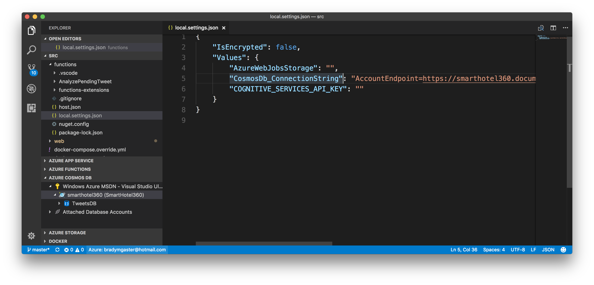

1. Copy the Storage Account's connection string using the Azure Storage explorer pane in Visual Studio Code. 

    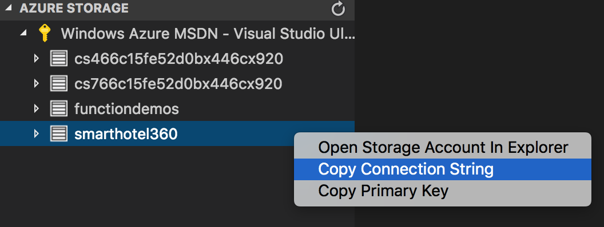

1. Paste the connection string value into the `AzureWebJobsStorage` property. 

    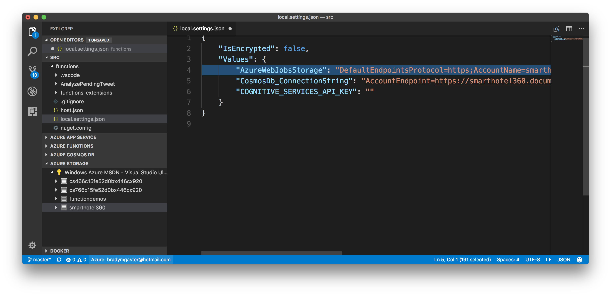

1. Copy the Cognitive Services API Key from the Azure Portal. Then, paste it into the `COGNITIVE_SERVICES_API_KEY` configuration property value in the `local.settings.json` file. 

    

1. Open the `Source/Function/AnalyzePendingTweet/dbconfig.js` file. 

    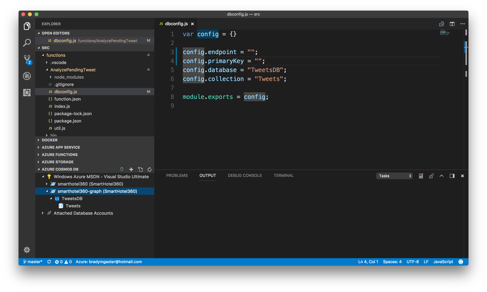

1. Right-click the node for the Cosmos DB (using **Graph** API) database you created earlier and select the **Open In Portal** option. 

    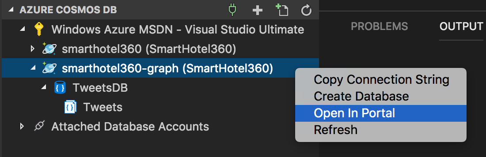

1. Copy the Gremlin Endpoint from the Azure Portal. 

    

1. Paste this value, but remove the port number and protocol, into the `Source/Function/AnalyzePendingTweet/dbconfig.js` file's `config.endpoint` property. 

    

1. Copy the primary key from the Azure Portal. 

    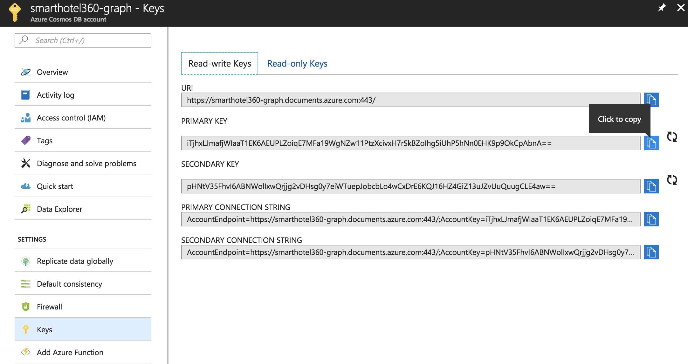

1. Paste the value into the `Source/Function/AnalyzePendingTweet/dbconfig.js` file's `config.primaryKey` property. 

    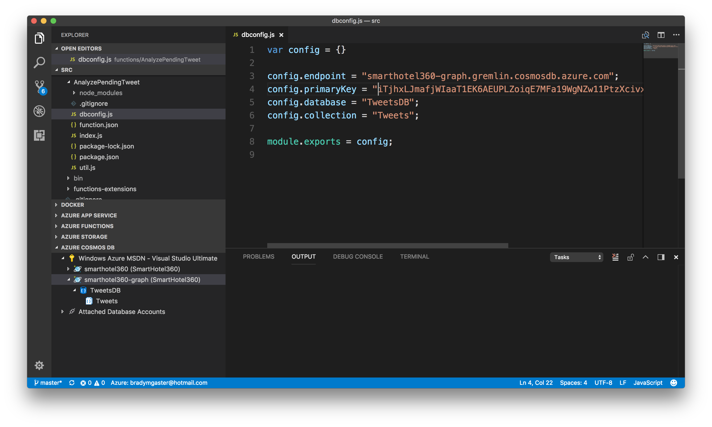

## Debug the Azure Function Locally

Once the Azure resources are set up and the local code is configured, the Azure Function can be debugged locally. With the Function running locally on your development machine, you can run the Logic App to collect incoming Tweets containing mentions of the `#SmartHotel360` hashtag. When you execute the Logic App, Tweet data is saved as a JSON document to Cosmos DB. When those documents are saved to the Cosmos DB, a Trigger is fired that results in your local Azure Function executing. Then, the Tweet data is analyzed using Cognitive Services Text Analytics, and the resulting data is then saved into a second Cosmos DB using the Graph API. 

1. Within the `Source/Function` folder execute the code below to install the Cosmos DB Function extension into your Azure Function project. 

    ```
    func extensions install --package Microsoft.Azure.WebJobs.Extensions.CosmosDB --version 3.0.3 
    ```

    > Note: You can learn more about Function Extensions in the [Azure Functions Host Wiki](https://github.com/Azure/azure-functions-host/wiki/Binding-Extensions-Management). 

1. Open Visual Studio Code with the `Source/Function` directory set as your workspace. 

1. Hit the **Debug** button in Visual Studio Code or hit the `F5` key to start debugging the Azure Function locally. You should see the Azure Functions CLI emit logging data in the Visual Studio Code terminal window. 

    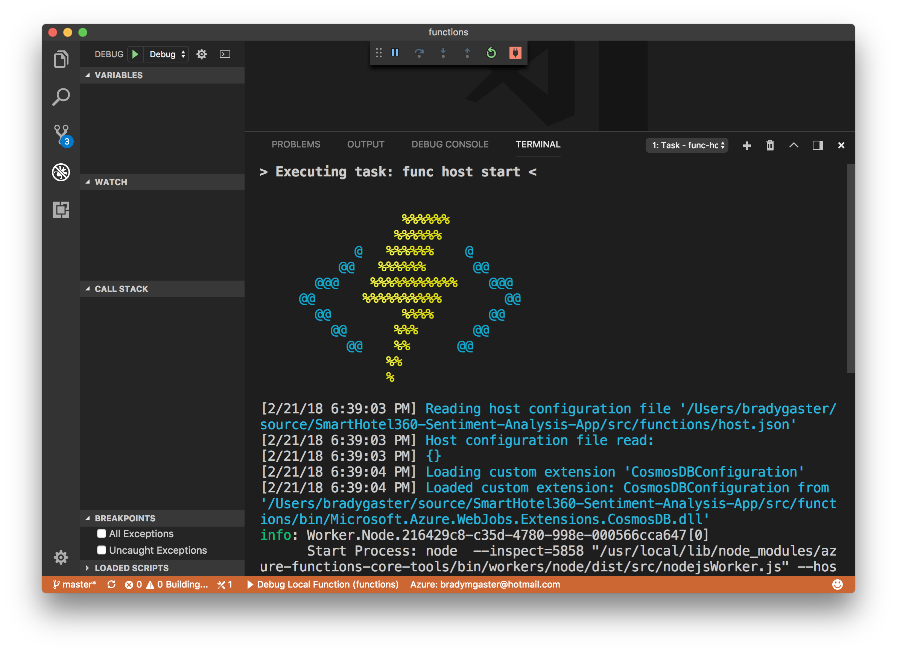

1. Open two browser tabs to make the debugging experience convenient: 

    * The Logic App designer in the Azure Portal
    * The Data Explorer tab of the Cosmos DB you created using a SQL API

1. Post a Tweet to your Twitter account using the `#smarthotel360` hash tag. 

1. Click the **Run** button to execute the Logic App.

    

1. Once the Logic App executes, the Tweet data is collected and saved to the Cosmos DB database. You can look in the Data Explorer for the Cosmos DB with the SQL API and see the document. 

    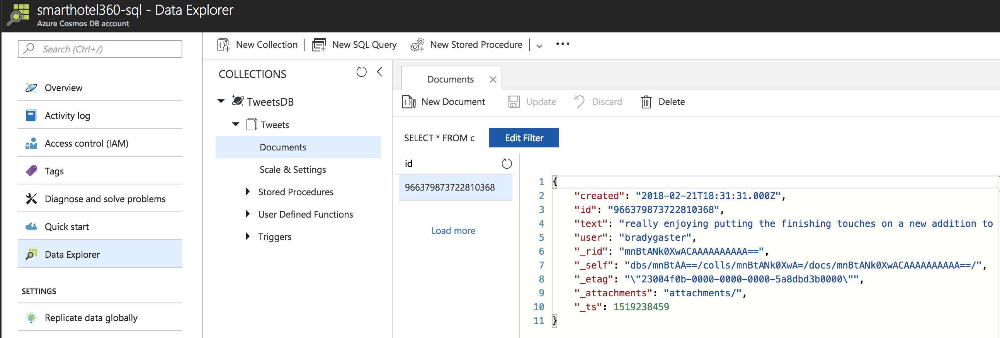

1. When the document is saved to the Cosmos DB database, the Function attached to it is immediately triggered and the execution is visible in the Visual Studio Code debugger. 

    

1. By opening the Cosmos DB Graph explorer in Visual Studio Code, you can navigate through the data that was saved to the Graph. 

    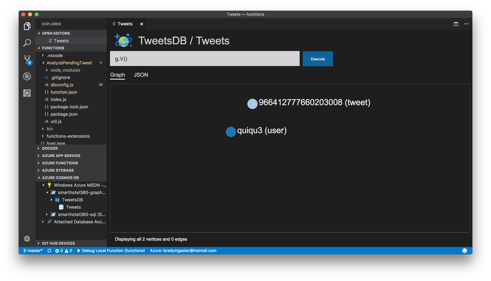

1. You can deploy the Azure Function with right-click on Function code and selecting Deploy to Azure and selecting your Azure subscription and the Function you created. This will create a zip package and send it to Azure.

    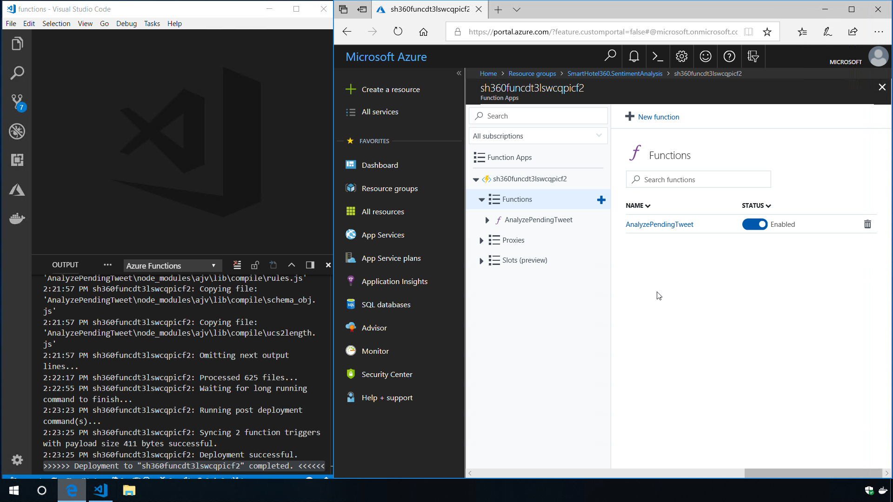

### Configure the Web Site

1. Open Visual Studio Code with the `Source\Website` directory set as your workspace. 

1. Copy your Bing Maps API key from the Azure Portal and paste it into the `Source\Website\client\js\webConfig.js` file to the value of the `mapQueryKey` property. 

    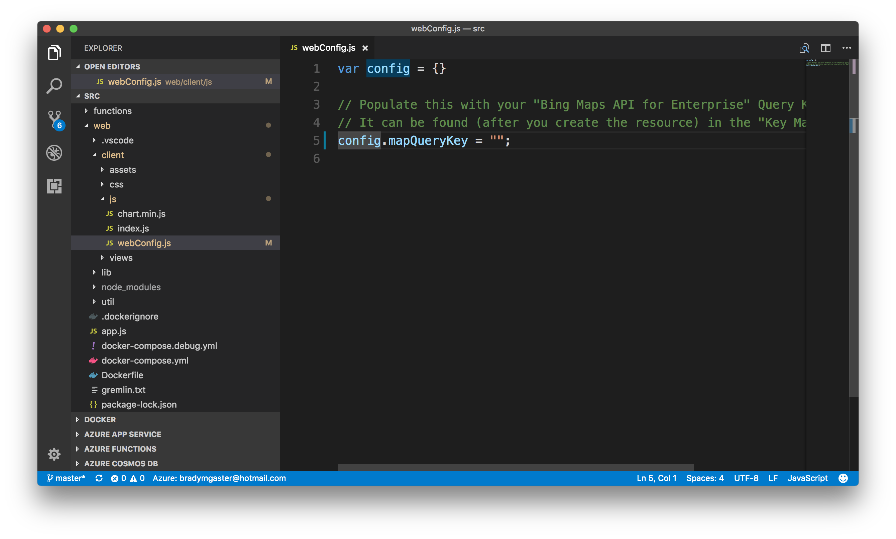

1. Copy the Cosmos DB Graph API database's Gremlin Endpoint and Primary Key into the `Source\Website\util\dbconfig.js` file's `endpoint` and `primarykey` properties. 

    

### Debug the Web Site

The web site with this demo enables the employees of SmartHotel360 to see the social sentiment of hotels in the New York City area. A clickable map shows the hotels as green or red circles that, when clicked, show the general Twitter sentiment analysis of each hotel. 


1. To populate the Cosmos DB database with sample data, uncomment the call to the `dbUtil` file in `app.js.` 

    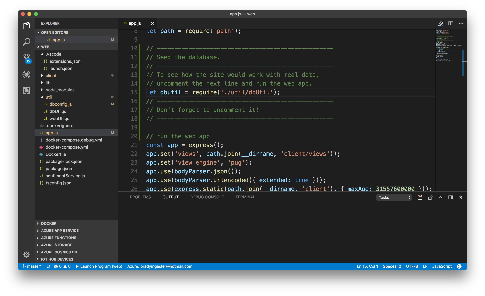

    > Note: Before debugging the app you should comment this out again!

1. Comment the line out again before debugging, then hit `F5` to launch the web site in the Visual Studio Code debugger. Once the debugger launches, the site will be available at [http://localhost:3000](http://localhost:3000). 

When the site launches, click some of the circles to see the sample data, then stop the debugger. 

### Build the Docker Image and Push it to Azure Container Registry

The Docker tools for Visual Studio Code make it easy to build Docker images when `docker-compose` files are in the workspace. 

1. Hit `F1` (Windows) or `Cmd-Shift-P` (Mac) to open the Command Pallete in Visual Studio Code. Then, type the string `docker` to see the Docker commands available. Select the `Docker Compose` command.  

    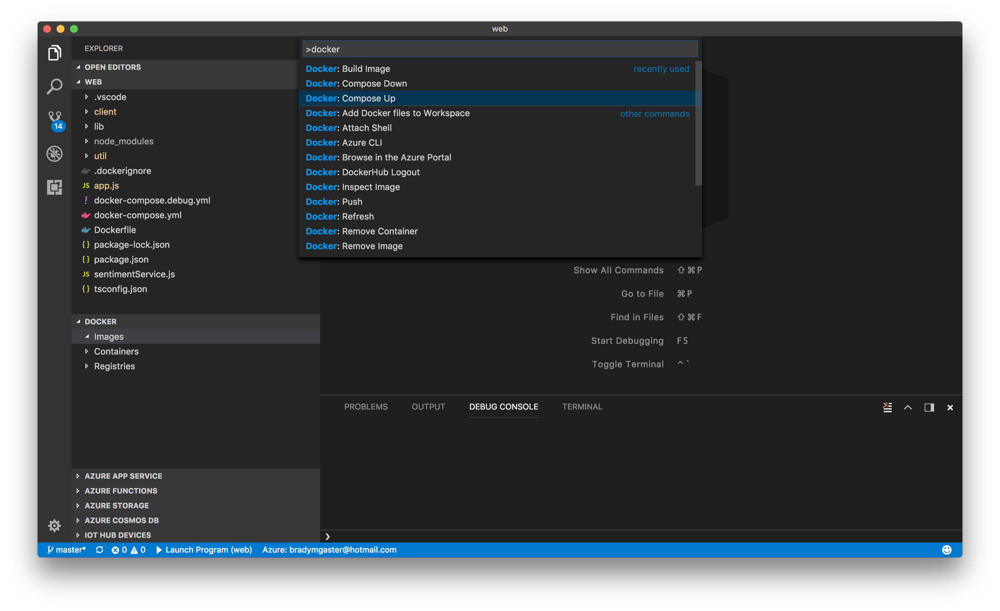

1. Select the `docker-compose.yml` file. 

    

1. Once the image is built you will see the output in the Visual Studio Code terminal. You can also see that the image is now visible in the **Images** node of the Docker Explorer. 
    
    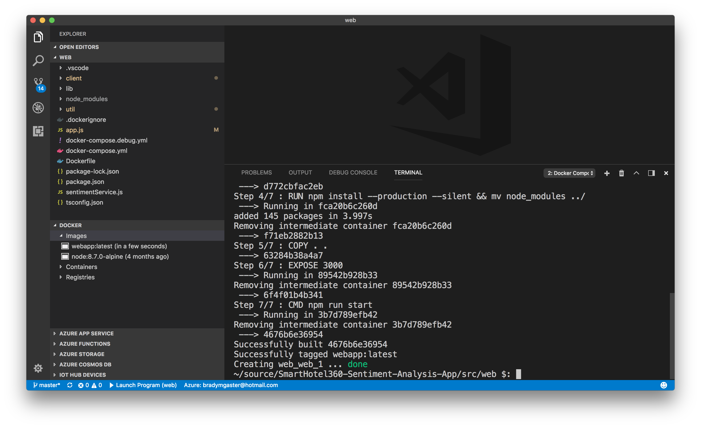

    > Note: The screen shot above also shows the `node:alpine` image, but the version may vary over time. What's important is that you see the `webapp:latest` image in the list. 

1. Navigate to the Azure Container Registry resource you created earlier, and click the **Access keys** menu option. Verify you have enabled the Admin user. 

    

1. Enter the following commands into the Visual Studio Code terminal window, replacing the `{username}`, `{password}`, and `{loginServer}` with values from the Azure Portal. 

    ```
    docker login -u {username} -p {password} {loginServer}
    docker tag webapp:latest {loginServer}/webapp
    docker push {loginServer}/webapp
    ```

    The terminal window will provide detailed status as the image is pushed to Azure Container Registry. Once it is complete, you can refresh the Docker Explorer to see the image has been published to the ACR resource. 

    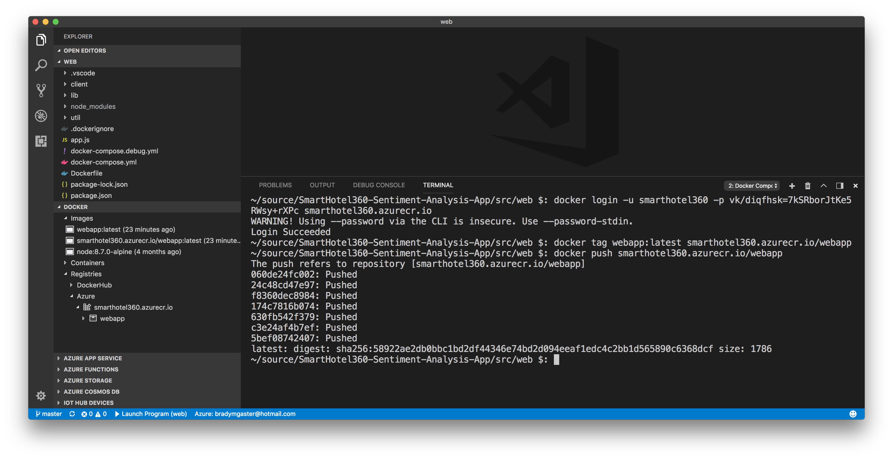

### Publish the Image to App Service

The final step in the deployment process is to pubish the Docker image from Azure Container Registry to Azure App Service. This can all be done within Visual Studio Code, and the site will be live in a few seconds. 

1. Right-click the `webapp:latest` image in the repository and select the **Deploy Image to Azure App Service** option. 

    

1. Select the Resource Group where you created the App Service Plan earlier. 

    

1. Select the App Service Plan you created earlier. 
    
    

1. Give the new App Service a name. This will need to be a globally unique name that will be used as the prefix to a URL ending with `azurewebsites.net`.

    

1. Visual Studio Code will publish the App Service from the Azure Container Registry image in a few seconds. By `ctrl` or `cmd`-clicking the URL in the output window, you can load the app in your browser. 

    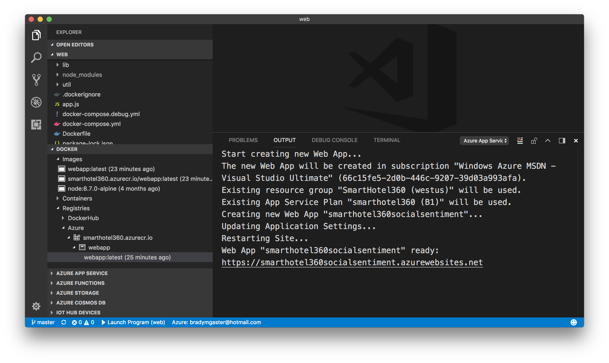

1. Now the app is running, and you can see the social sentiments in the map. 

    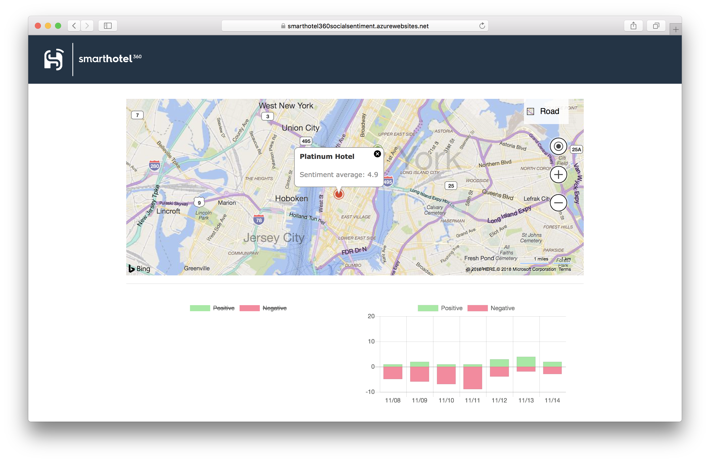

## Contributing

This project welcomes contributions and suggestions.  Most contributions require you to agree to a
Contributor License Agreement (CLA) declaring that you have the right to, and actually do, grant us
the rights to use your contribution. For details, visit https://cla.microsoft.com.

When you submit a pull request, a CLA-bot will automatically determine whether you need to provide
a CLA and decorate the PR appropriately (e.g., label, comment). Simply follow the instructions
provided by the bot. You will only need to do this once across all repos using our CLA.

This project has adopted the [Microsoft Open Source Code of Conduct](https://opensource.microsoft.com/codeofconduct/).
For more information see the [Code of Conduct FAQ](https://opensource.microsoft.com/codeofconduct/faq/) or
contact [opencode@microsoft.com](mailto:opencode@microsoft.com) with any additional questions or comments.
