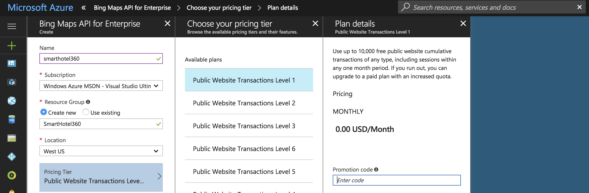
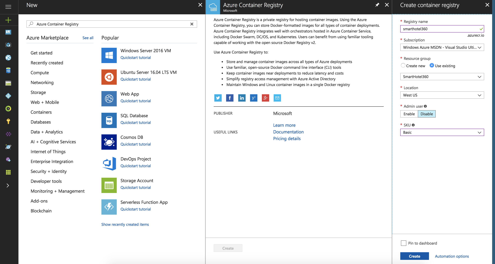
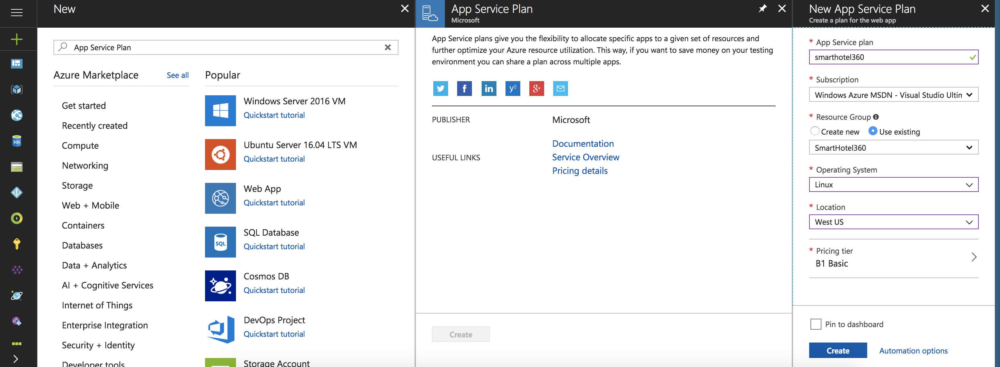
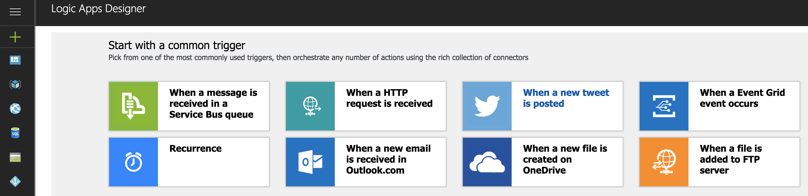
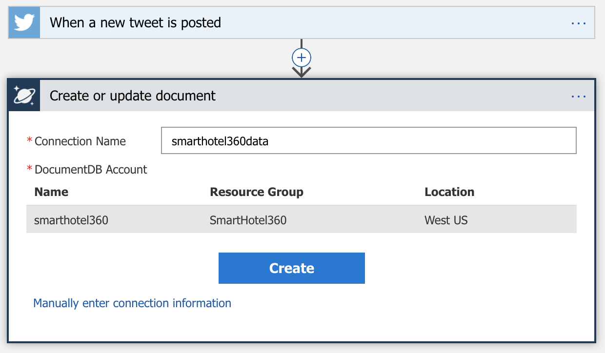
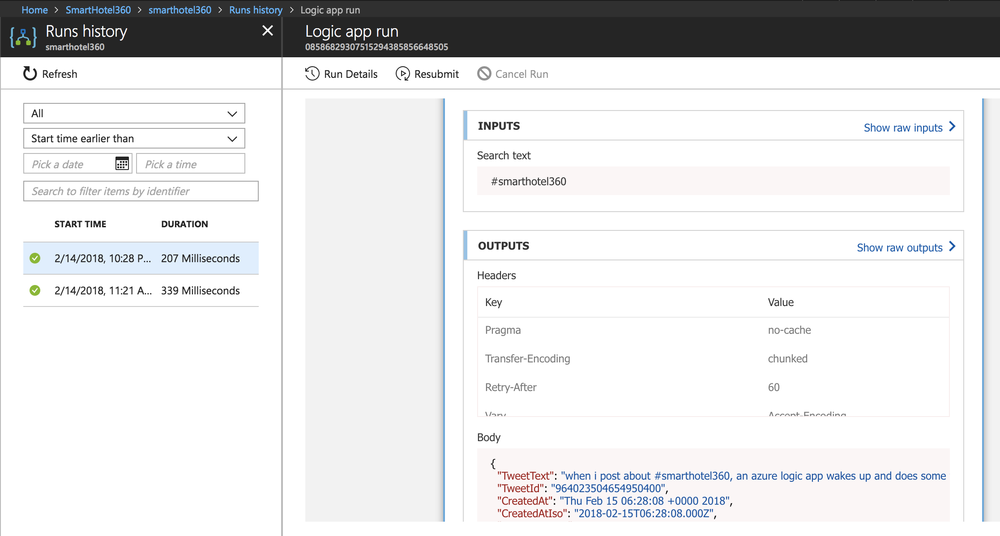
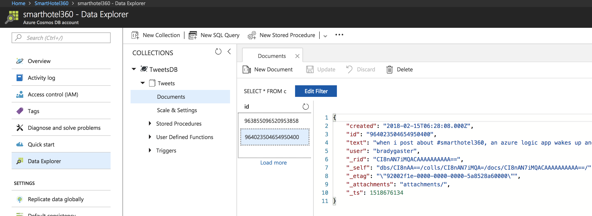

# SmartHotel360

_**Note:** This repo is under construction and within the next few days we will release the code and more details on this Readme. Please stay tuned!_

During our **Connect(); 2017** event this year we presented beautiful app demos using Microsoft developer tools and technologies.

We are happy to announce the release of SmartHotel360. This release intends to share a simplified version of SmartHotel360 reference sample apps used at Connect(); 2017 Keynotes. If you missed it, you can watch <a href="https://channel9.msdn.com/Events/Connect/2017/K100">Scott Guthrie’s Keynote: Journey to the Intelligent Cloud</a> on Channel 9.


## Sentiment Analysis App
This repo contains the Node.js Sentiment Analysis App built with Visual Studio Code.

For hotel managers, we built a simple Node.js website to analyze customer sentiment from Twitter by using Text Analysis Cognitive Services APIs. This website was built with Visual Studio Code and we used multiple of our newest extensions for Cosmos DB, App Service, Azure Functions, and Docker for Visual Studio Code and Azure to build this app.

## Other SmartHotel360 Repos
For this reference app scenario, we built several consumer and line-of-business apps and an Azure backend. You can find all SmartHotel360 repos in the following locations:

* [SmartHotel360 ](https://github.com/Microsoft/SmartHotel360)
* [Backend Services](https://github.com/Microsoft/SmartHotel360-Azure-backend)
* [Public Website](https://github.com/Microsoft/SmartHotel360-public-web)
* [Mobile Apps](https://github.com/Microsoft/SmartHotel360-mobile-desktop-apps)
* [Sentiment Analysis](https://github.com/Microsoft/SmartHotel360-Sentiment-Analysis-App)

## Azure Setup

This section will walk through using the Azure Portal and Visual Studio Code to create all of the resources you'd need to deploy the demo to Azure. 

1. Create a Bing Maps API for Enterprise resource in the Azure Portal by clicking the **New** button, then searching for `Bing` and selecting the **Bing Maps API for Enterprise** option. 

    

1. The free tier for public web sites should be appropriate for getting started. 

    

1. Create a new Azure Container Registry resource by clicking the **New** button in the Azure Portal, then searching for `Registry.` Any tier of service would be appropriate. Create the resource in the same resource group as the Bing Maps API for Enterprise resource. 

    

1. Once the Azure Container Registry instance has been created, enable the Admin user as shown in the screen shot below. 

    

1. Create a new Basic Linux App Service Plan in the same region and resource group as the Azure Container Registry and Bing Maps API for Enterprise resources. 

    

1. Create a Cognitive Services Text Analytics API resource using the Azure Portal. 

    

1. Create a new Cosmos DB database, and select the SQL API. 

    

1. Create a new collection in the Cosmos DB database using the Azure Portal's Data Explorer. Name the **Database Id** `TweetsDB` and the **Collection Id** `Tweets`. 

    

1. Create a new Logic App using the Azure Portal. 

    

1. Navigate to the Logic App in the Azure Portal, and select the **When a new tweet is posted** trigger. 

    

1. You'll need to log in to your Twitter account and to give it access to the Azure Logic App to login as you. 

    > Note: The Logic App won't post tweets or mine your followers. The reason for logging in with a real Twitter account is so the Logic App can pull Tweets and scan them for keywords. 

1. Enter the string `#smarthotel360` in the **Search text** box. Then, click the **New step** button. Then, click the **Add an action** button.  

    

1. Add a new **Azure Cosmos DB - Create or update document** action. 

    

1. Give the connection a name, and select the Cosmos DB resource you created earlier that uses the SQL API. 

    

1. Provide the string `TweetsDB` for the **Database ID** field, `Tweets` for the **Collection ID** field, and then paste in the JSON code below into the **Document** field. 

    ```json
    {
        "created": "@triggerBody()?['CreatedAtIso']",
        "id": "@triggerBody()?['TweetId']",
        "text": "@triggerBody()?['TweetText']",
        "user": "@{triggerBody()?['TweetedBy']}"
    }
    ```
    When you've completed this step the Logic App designer should look like the screen shot below. 

    

1. Click the **Save** button in the Logic App Designer. Once the Logic App has been saved the view of the *Create or update document* step should change somewhat, demonstrating that the JSON will be constructed using properties from the incoming Tweet. 

    

## Run the Logic App

Once the Logic App has been saved, testing it out is as easy as posting a Tweet containing the desired string. The next time the Logic App is triggered, the JSON data captured is visible in the Logic App Designer.



Using the Cosmos DB Data Explorer in the Azure Portal, you can see the JSON document that has been from the Logic App execution. 



## Local Development Setup


## Contributing

This project welcomes contributions and suggestions.  Most contributions require you to agree to a
Contributor License Agreement (CLA) declaring that you have the right to, and actually do, grant us
the rights to use your contribution. For details, visit https://cla.microsoft.com.

When you submit a pull request, a CLA-bot will automatically determine whether you need to provide
a CLA and decorate the PR appropriately (e.g., label, comment). Simply follow the instructions
provided by the bot. You will only need to do this once across all repos using our CLA.

This project has adopted the [Microsoft Open Source Code of Conduct](https://opensource.microsoft.com/codeofconduct/).
For more information see the [Code of Conduct FAQ](https://opensource.microsoft.com/codeofconduct/faq/) or
contact [opencode@microsoft.com](mailto:opencode@microsoft.com) with any additional questions or comments.
